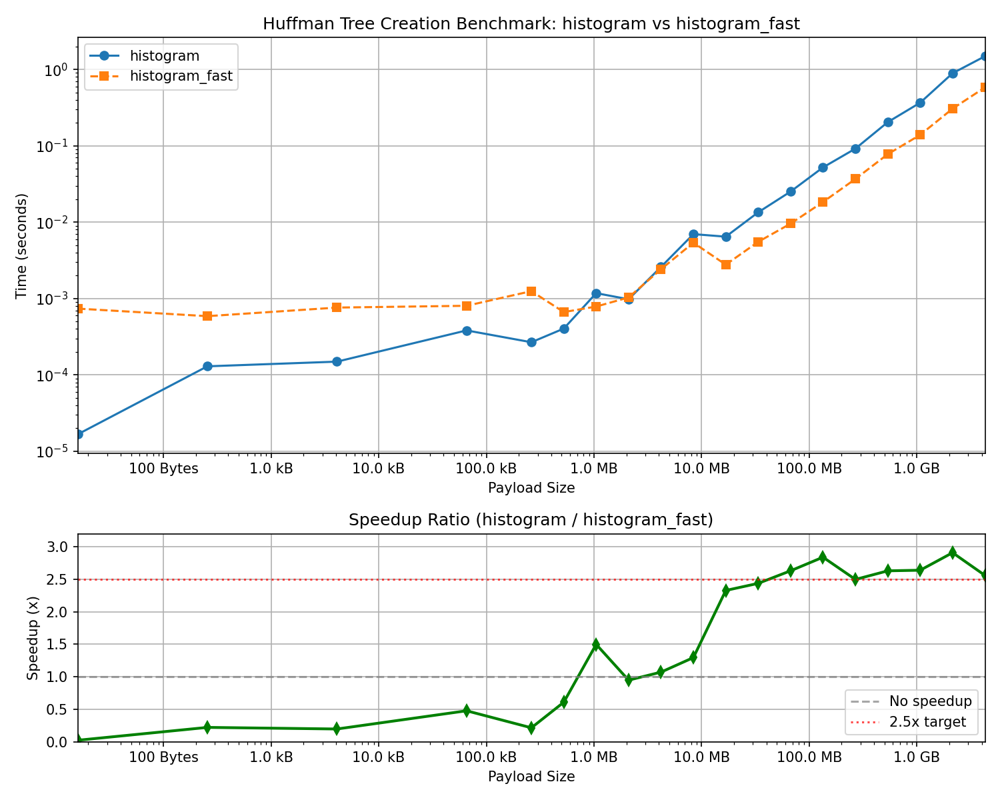

# Lecture: Low-Level Optimization in C++ — A Case Study

## The Problem: Building a Huffman Tree

To compress data using Huffman coding, we need to count byte frequencies. For a 4GB file, this means iterating over **4 billion bytes**. Can we make this fast?



*Our journey: from 1.5 seconds down to 0.6 seconds — a 2.6x speedup!*

### Benchmark Results (4GB data, 8 cores):

| Function | Time | vs Baseline |
|----------|------|-------------|
| `histogram` (baseline) | 1490 ms | 1.0x |
| `histogram_parallel` | 830 ms | 1.8x |
| `histogram_parallel_64bit` | 650 ms | 2.3x |
| `histogram_fast` | 583 ms | 2.6x |

---

## What We'll Learn

In this lecture, we'll examine **real compiled assembly** to understand:

1. **Why parallelization helps** — and its limits
2. **How memory access patterns matter** — 64-bit loads vs byte loads  
3. **When SIMD is worth it** — and when it's not
4. **How return types affect performance** — Named Return Value Optimization (NRVO)

**Key insight**: The compiler is your friend. Learn to read its output!

---

## The Optimization Journey

| Function                 | Parallelism | 64-bit Loading | SIMD Merge | Speedup |
|--------------------------|-------------|----------------|------------|---------|
| `histogram`              | ❌          | ❌             | ❌         | 1.0x    |
| `histogram_parallel`     | ✅          | ❌             | ❌         | 1.8x    |
| `histogram_parallel_64bit`| ✅         | ✅             | ❌         | 2.3x    |
| `histogram_fast`         | ✅          | ✅             | ✅         | 2.6x    |

Let's look at each step and see **exactly what the compiler generates**.

---

## Table of Contents
1. [Step 1: The Baseline](#step-1-the-baseline---histogram)
2. [Step 2: Add Parallelism](#step-2-add-parallelism---histogram_parallel)
3. [Step 3: Smarter Memory Access](#step-3-smarter-memory-access---histogram_parallel_64bit)
4. [Step 4: SIMD Vectorization](#step-4-simd-vectorization---histogram_fast)
5. [Named Return Value Optimization](#named-return-value-optimization-nrvo)
6. [Key Takeaways](#key-takeaways)

---

## Step 1: The Baseline - `histogram`

**C++ Source:**
```cpp
std::array<uint64_t, 256> histogram(std::span<const std::byte> data) {
    std::array<uint64_t, 256> freqs = {0};
    for (std::byte b : data) {
        freqs[static_cast<unsigned char>(b)]++;
    }
    return freqs;
}
```

**Annotated Assembly (hot loop):**

```armasm
.L66:
    ldrb    w2, [x0], 1         ; 🔴 w2 = *ptr++  (load ONE byte, advance pointer)
    ldr     x1, [x8, x2, lsl 3] ; x1 = freqs[w2]  (load current count)
    add     x1, x1, 1           ; x1++            (increment)
    str     x1, [x8, x2, lsl 3] ; freqs[w2] = x1  (store back)
    cmp     x3, x0              ; if (end != ptr)
    bne     .L66                ;     goto .L66   (continue loop)
```

### 🔍 Key Observations:
- **`ldrb w2, [x0], 1`** - Loads a single byte. The `b` suffix means "byte".
- **One byte per iteration** - 8x more loop iterations than necessary.
- **No parallelism** - Single thread processes entire input.

> 💡 **Question for students**: We're processing 4 billion bytes. Each iteration
> does: load, lookup, increment, store, compare, branch. That's 4 billion
> loop iterations! Can we reduce that overhead?

---

## Step 2: Add Parallelism - `histogram_parallel`

**C++ Source:**
```cpp
std::array<uint64_t, 256> histogram_parallel(std::span<const std::byte> data) {
    const int num_threads = omp_get_max_threads();
    std::vector<std::array<uint64_t, 256>> partial_freqs(num_threads);

    const size_t chunk_size = (data.size() + num_threads - 1) / num_threads;

    #pragma omp parallel
    {
        int thread_id = omp_get_thread_num();
        auto& local_freqs = partial_freqs[thread_id];
        local_freqs.fill(0);

        const size_t start = thread_id * chunk_size;
        const size_t end = std::min(start + chunk_size, data.size());

        // Simple byte-by-byte processing, no 64-bit loading
        for (size_t i = start; i < end; ++i) {
            local_freqs[static_cast<unsigned char>(data[i])]++;
        }
    }

    // Merge partial histograms - no SIMD
    std::array<uint64_t, 256> freqs = partial_freqs[0];
    for (int t = 1; t < num_threads; ++t) {
        for (size_t bin = 0; bin < 256; ++bin) {
            freqs[bin] += partial_freqs[t][bin];
        }
    }

    return freqs;
}
```

**Annotated Assembly (OpenMP worker - hot loop):**

```armasm
_Z18histogram_parallelSt4spanIKSt4byteLm18446744073709551615EE._omp_fn.0:
    ...
    bl      omp_get_thread_num  ; 🟢 thread_id = omp_get_thread_num()
    ...
.L3:
    ldrb    w2, [x0], 1         ; 🔴 w2 = *ptr++  (still loading ONE byte)
    ldr     x1, [x3, x2, lsl 3] ; x1 = local_freqs[w2]
    add     x1, x1, 1           ; x1++
    str     x1, [x3, x2, lsl 3] ; local_freqs[w2] = x1
    cmp     x4, x0              ; if (end != ptr)
    bne     .L3                 ;     continue
```

### 🔍 Key Observations:
- **`omp_get_thread_num()`** call shows OpenMP parallelization is active.
- **Still `ldrb`** - Each thread loads one byte at a time.
- **Speedup**: ~1.8x on 8 cores (good, but we can do better!).

> 💡 **Why only 1.8x on 8 cores?** Several factors limit scaling:
> memory bandwidth is shared, the merge phase is serial, and each thread
> still pays per-byte loop overhead. Let's tackle that last one next!

---

## Step 3: Smarter Memory Access - `histogram_parallel_64bit`

**The Insight**: This is a 64-bit CPU. The registers are 64 bits. The memory bus is 64 bits. Yet we're loading one byte at a time!

The **byte** is the minimum *addressable* unit, but the **64-bit word** is the native *operational* unit. When we do `ldrb` (load byte), the CPU still fetches a full word from cache and then extracts and zero-extends just one byte. We're throwing away 7/8 of the work!

By loading 64 bits at once and extracting the bytes ourselves, we align our code with how the hardware actually works.
We have traded off a few extra bit manipulations (often called _arithmetic intensity_) for much fewer memory accesses and loop overhead.

**C++ Source:**
```cpp
std::array<uint64_t, 256> histogram_parallel_64bit(std::span<const std::byte> data) {
    const int num_threads = omp_get_max_threads();
    std::vector<std::array<uint64_t, 256>> partial_freqs(num_threads);

    const size_t chunk_size = (data.size() + num_threads - 1) / num_threads;

    #pragma omp parallel
    {
        int thread_id = omp_get_thread_num();
        auto& local_freqs = partial_freqs[thread_id];
        local_freqs.fill(0);

        const size_t start = thread_id * chunk_size;
        const size_t end = std::min(start + chunk_size, data.size());

        const auto* ptr = reinterpret_cast<const uint64_t*>(data.data() + start);
        size_t remaining = end - start;

        // Process 8 bytes at a time
        while (remaining >= 8) {
            uint64_t word = *ptr;

            local_freqs[(word >>  0) & 0xFF]++;
            local_freqs[(word >>  8) & 0xFF]++;
            local_freqs[(word >> 16) & 0xFF]++;
            local_freqs[(word >> 24) & 0xFF]++;
            local_freqs[(word >> 32) & 0xFF]++;
            local_freqs[(word >> 40) & 0xFF]++;
            local_freqs[(word >> 48) & 0xFF]++;
            local_freqs[(word >> 56) & 0xFF]++;

            ptr++;
            remaining -= 8;
        }

        // Handle remaining bytes
        const auto* byte_ptr = reinterpret_cast<const uint8_t*>(ptr);
        while (remaining > 0) {
            local_freqs[*byte_ptr]++;
            byte_ptr++;
            remaining--;
        }
    }

    // Merge partial histograms - no SIMD
    std::array<uint64_t, 256> freqs = partial_freqs[0];
    for (int t = 1; t < num_threads; ++t) {
        for (size_t bin = 0; bin < 256; ++bin) {
            freqs[bin] += partial_freqs[t][bin];
        }
    }

    return freqs;
}
```

**Annotated Assembly (hot loop):**

```armasm
.L13:
    ldr     x0, [x2], 8         ; 🟢 x0 = *ptr; ptr += 8  (load 8 BYTES at once!)
    
    and     x10, x0, 255        ; x10 = word & 0xFF         (byte 0)
    ubfx    x9, x0, 8, 8        ; x9  = (word >> 8) & 0xFF  (byte 1)  
    ubfx    x8, x0, 16, 8       ; x8  = (word >> 16) & 0xFF (byte 2)
    lsr     w7, w0, 24          ; x7  = (word >> 24) & 0xFF (byte 3)
    ubfx    x6, x0, 32, 8       ; x6  = (word >> 32) & 0xFF (byte 4)
    ubfx    x5, x0, 40, 8       ; x5  = (word >> 40) & 0xFF (byte 5)
    ubfx    x4, x0, 48, 8       ; x4  = (word >> 48) & 0xFF (byte 6)
    lsr     x0, x0, 56          ; x0  = (word >> 56)        (byte 7)
    
    ; Increment histogram for each byte:
    ldr     x1, [x3, x10, lsl 3]  ; load freqs[byte0]
    add     x1, x1, 1             ; increment
    str     x1, [x3, x10, lsl 3]  ; store back
    
    ldr     x1, [x3, x9, lsl 3]   ; load freqs[byte1]
    add     x1, x1, 1
    str     x1, [x3, x9, lsl 3]
    
    ; ... (repeat for all 8 bytes)
    
    cmp     x2, x11             ; if (ptr != end)
    bne     .L13                ;     continue
```

### 🔍 Key Observations:

| Instruction | Meaning |
|-------------|---------|
| **`ldr x0, [x2], 8`** | 🟢 **64-bit load** - fetches a full native word! |
| **`ubfx x9, x0, 8, 8`** | "Unsigned Bit Field eXtract" - extracts bits [15:8] → byte 1 |
| **`lsr w7, w0, 24`** | "Logical Shift Right" - extracts byte 3 |

- **Work with the hardware, not against it** - 64-bit loads match the CPU's native word size.
- **8x fewer loop iterations** - amortizes branch, compare, and pointer increment overhead.
- **Instruction-Level Parallelism (ILP)** - all 8 `ubfx` extractions use independent registers, so the CPU can execute them in parallel.
- **Bit manipulation is cheap** - `ubfx` is a single-cycle instruction.
- **Speedup**: Additional ~0.4x on top of parallelization.

> 💡 **The key insight**: Bytes are an abstraction. The hardware deals in 64-bit
> words. By loading a full word and extracting bytes ourselves, we do the same
> memory access but get 8x the useful data. Plus, loop overhead is amortized
> and the bit extractions can run in parallel on the CPU's execution units.

---

## Step 4: SIMD Vectorization - `histogram_fast`

**The Idea**: Can we use SIMD to speed up the merge phase?

Same as `histogram_parallel_64bit` for the counting phase, but uses **SIMD for merging** partial histograms.

**C++ Source (merge loop):**
```cpp
std::array<uint64_t, 256> freqs = partial_freqs[0];
for (int t = 1; t < num_threads; ++t) {
    #pragma omp simd
    for (size_t bin = 0; bin < 256; ++bin) {
        freqs[bin] += partial_freqs[t][bin];
    }
}
```

**Annotated Assembly (SIMD merge loop):**

```armasm
.L134:
    ldr     q0, [x0, x2]        ; 🟣 q0 = load 128 bits (2 × uint64_t) from partial[t]
    ldr     q1, [x3]            ; 🟣 q1 = load 128 bits from freqs
    add     v0.2d, v0.2d, v1.2d ; 🟣 v0 = v0 + v1 (SIMD add: 2 × 64-bit in parallel!)
    str     q0, [x3], 16        ; 🟣 store 128 bits back to freqs; freqs += 16
    cmp     x2, 2048            ; if (offset < 2048)  [256 × 8 bytes]
    bne     .L134               ;     continue
```

### 🔍 Key Observations:

| Instruction | Meaning |
|-------------|---------|
| **`ldr q0, [x0, x2]`** | Load into 128-bit NEON register (Q = quad-word) |
| **`add v0.2d, v0.2d, v1.2d`** | 🟣 **SIMD addition** - adds TWO 64-bit integers in ONE instruction! |
| **`.2d`** | Vector of 2 double-words (2 × 64-bit) |

- **2x throughput** on the merge loop (but merge is tiny compared to counting).
- **Negligible real-world impact** - the merge operates on only 2KB of data.
- **Main lesson**: SIMD helps when data is large; overhead dominates for small data.

> 💡 **When does SIMD help?** SIMD shines when you have large, contiguous arrays
> of data. Our histogram is only 256 × 8 = 2KB. The counting loop processes
> 4GB — that's where optimization effort should focus!

---

## Named Return Value Optimization (NRVO)

### What is NRVO?

**Named Return Value Optimization (NRVO)** allows the compiler to construct the return value **directly in the caller's memory**, avoiding a copy.

**Without NRVO:**
```
caller allocates space → function builds locally → COPY to caller → destroy local
```

**With NRVO:**
```
caller allocates space → function builds DIRECTLY there → done (zero copy!)
```

### Simplified C++ Source:
```cpp
std::vector<HuffmanNode> huffman_tree(const std::array<uint64_t, 256>& hist) {
    std::vector<HuffmanNode> nodes;  // ← Built directly in caller's memory!
    
    // ... build the tree ...
    
    return nodes;  // ← No copy! Just return.
}
```

### Annotated Assembly:

**Function Prologue - Capturing Return Address:**
```armasm
_Z12huffman_treeRKSt5arrayImLm256EE:
    stp     x29, x30, [sp, -128]!    ; Save frame pointer & return address
    mov     x29, sp                  ; Set up frame pointer
    ...
    mov     x21, x8                  ; 🟢 x21 = x8 (SAVE the return value address!)
                                     ;    x8 = where caller wants the result
```

> 📌 **Key insight**: On ARM64, `x8` holds the address where the caller wants
> a large return value constructed. The compiler saves this in `x21`.

**Constructing `nodes` Directly in Caller's Memory:**
```armasm
    ; std::vector<HuffmanNode> nodes;
    stp     xzr, xzr, [x8]          ; 🟢 nodes._M_start = nullptr
                                     ;    nodes._M_finish = nullptr  
                                     ;    (DIRECTLY at x8 - caller's memory!)
    str     xzr, [x8, 16]           ; 🟢 nodes._M_end_of_storage = nullptr
```

> 📌 **NRVO in action!** The vector is being initialized at `[x8]`, which is
> the caller's memory - NOT on this function's stack!

**Function Return - No Copy!**
```armasm
.L156:
    ; return nodes;
    ldp     x19, x20, [sp, 16]       ; Restore callee-saved registers
    mov     x0, x21                  ; 🟢 Return the SAME address we received!
    ldp     x21, x22, [sp, 32]       ;    (x21 still holds the original x8)
    ...
    ldp     x29, x30, [sp], 128      ; Restore frame pointer
    ret                              ; Return to caller
```

> 📌 **Zero-copy return!** We just return `x21` (the original `x8`).
> The vector was built in-place - nothing to copy!

---

## Key Takeaways

| Optimization | Speedup | Mechanism |
|--------------|---------|-----------|
| **Parallelization** | ~1.8x | Distribute work across cores |
| **64-bit Loading** | ~0.4x additional | 8x fewer loop iterations, better ILP |
| **SIMD Merge** | ~0x | Merge is too small to benefit |
| **NRVO** | Avoids 1 copy | Build in caller's memory |

### What We Learned:

1. **Bytes are an abstraction** — The CPU's native unit is 64 bits. A byte load fetches a word anyway; we were discarding 7/8 of it!
2. **Work with the hardware** — 64-bit loads match the architecture; extracting bytes is cheap (this is _memory pressure_ vs _arithmetic intensity_).
3. **Loop overhead matters** — 8x fewer iterations means 8x fewer branches, compares, increments.
4. **ILP is your friend** — Extracting 8 bytes into independent registers lets the CPU parallelize.
5. **Parallelism helps** — But you need enough work to overcome thread overhead.
6. **SIMD isn't magic** — It only helps when you have large, contiguous data.
7. **Read the assembly!** — The compiler tells you exactly what it's doing.

---

*Generated from `huffman_nrvo.s` compiled with GCC 13, -O3, targeting ARM64 (aarch64-linux-gnu).*

